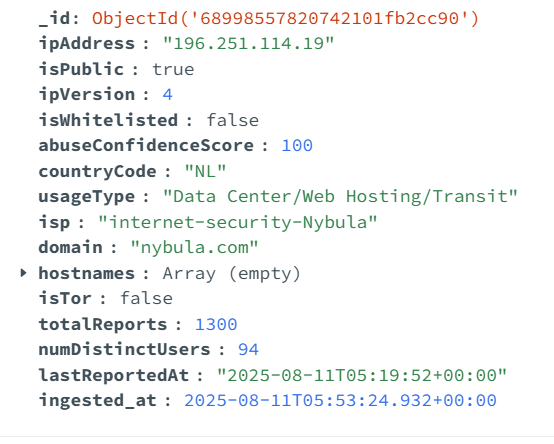

## Name: Nisha Ganesh

## Register Number: 3122 22 5001 084

## AbuseIPDB ETL Connector

This project connects to the [AbuseIPDB](https://www.abuseipdb.com/) API to:

1. Retrieve a list of blacklisted IP addresses.
2. Check detailed abuse reports for each IP.
3. Store the results in a MongoDB database.

The pipeline is designed to be modular, so you can run it periodically to keep your threat intelligence database up-to-date.

---

## API Endpoints Used

### **1. Blacklist API**

Retrieves a list of the most reported IP addresses.

**Endpoint:**

GET [https://api.abuseipdb.com/api/v2/blacklist]()

### **2. Check API**

Retrieves detailed information for a given IP address.

**Endpoint:**

GET [https://api.abuseipdb.com/api/v2/check]()

<h4>USAGE</h4>

<h5>1. Install dependencies</h5>

pip install -r requirements.txt

<h5>2. Create .env file</h5>

ABUSEIPDB_API_KEY=your_api_key_here
MONGODB_URI=mongodb://localhost:27017
MONGO_DB_NAME=abuseipdb
MONGO_COLLECTION_NAME=abuseipdb_raw

<h5>3. Run the ETL pipeline</h5>

python main.py

<h4>Sample Data Inserted in MongoDB</h4>

